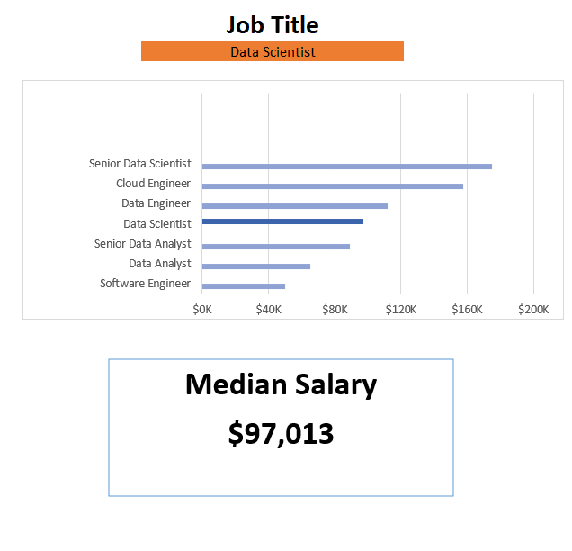
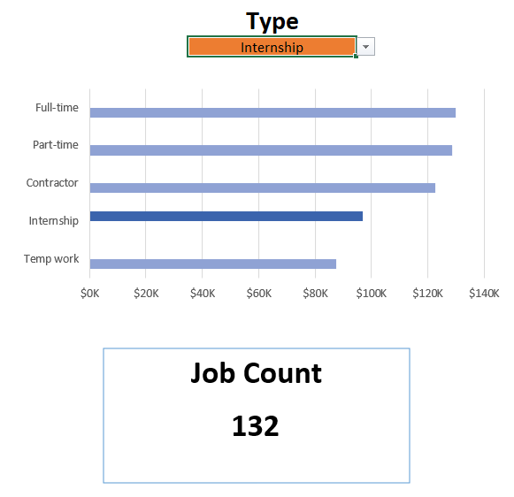

# 💼 Data Science Salary Calculator Dashboard

An interactive Excel dashboard built to explore, compare, and calculate salaries across various **data science job roles**, **countries**, and **job platforms**.  
It helps analysts and job seekers quickly estimate pay scales and analyze trends in the data science job market.

---

## 📊 Dashboard Preview

**Interactive Demo**  


**Screenshots**

| Salary Overview | Platform Insights |
|-----------------|------------------|
|  |  |

---

## 🧩 Features

- **Salary Calculator:** Estimate salaries by selecting job title, country, and work type (Full-time, Contract, etc.).
- **Median Salary Overview:** Compare pay ranges across key data roles such as Data Analyst, Data Scientist, and Machine Learning Engineer.
- **Platform Insights:** Analyze where jobs are most frequently posted (Indeed, LinkedIn, ZipRecruiter, etc.).
- **Country-Level Trends:** View salary differences between regions.
- **Structured Data Model:** Includes multiple sheets like Data, Median_Salary, Salary_Calculator, Title, and Platform.

---

## 🧠 Key Insights

- 💰 **Top Paying Role:** Senior Data Scientist — median salary around **$155,000**  
- 🧮 **Average Data Engineer Salary:** Roughly **$125,000**  
- 🌍 **Primary Market:** Majority of listings are from the **United States**  
- 🖥️ **Most Active Platform:** **Indeed** with ~961 job postings  
- 📈 **Health Benefits:** Offered in most full-time positions  

*(Values derived from the dataset used in this Excel dashboard.)*

---

## ⚙️ How to Use

1. **Download the file**  
   `excel-job-salary-calculator.xlsx`

2. **Open in Microsoft Excel** (or Google Sheets for viewing).

3. **Explore these sheets:**
   - `Salary_Calculator` → Input your job role and country to estimate salary.  
   - `Median_Salary` → Check typical pay ranges across roles.  
   - `Platform` → See which job sites host the most postings.  
   - `Data` → Underlying dataset for all visuals.

---

## 🧰 Tech Stack

- **Tool:** Microsoft Excel  
- **Data Source:** Aggregated job listings with salary and metadata  
- **Sheets Used:** Data, Median_Salary, Salary_Calculator, Title, Platform  

---

## 📁 Folder Structure

```
📦 Excel-Job-Salary-Calculator
┣ 📜 excel-job-salary-calculator.xlsx
┣ 📂 .github
┃ ┗ 📂 images
┃ ┣ dashboard-demo.gif
┃ ┣ salary-overview.png
┃ ┣ role-comparison.png
┃ ┗ platform-insights.png
┗ 📜 README.md
```
---

## 👤 Author

**Devendra Singh**  
📧 [devendras162002@gmail.com]  
🌐 [LinkedIn](https://www.linkedin.com/in/devendra-singh-adhikari) | [GitHub](https://github.com/devendra-coder)
